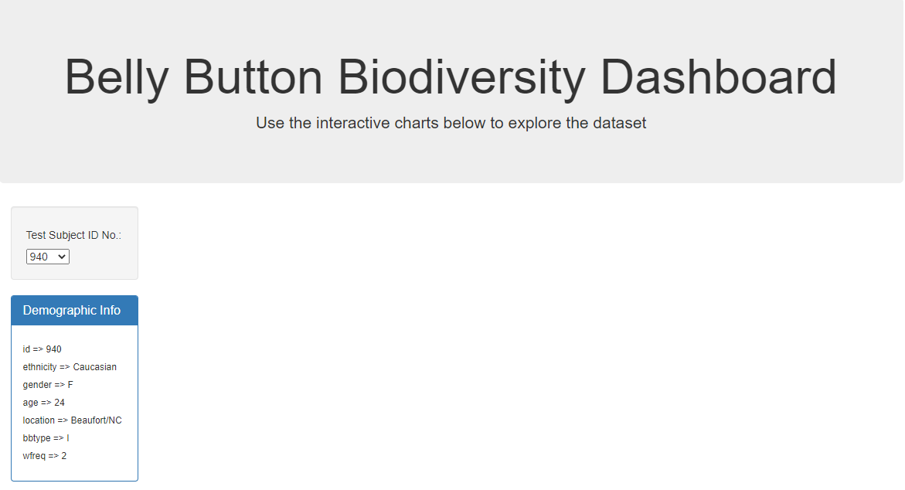
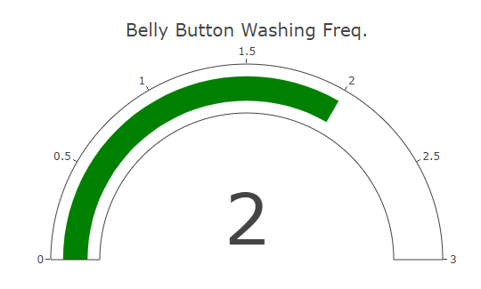

# javascript-challenge
---
The task of this assignment is to build an interactive dashboard to explore the Belly Button Biodiversity dataset, which catalogs the microbes that colonize human navels. The dataset reveals that a small handful of microbial species (also called operational taxonomic units, or OTUs, in the study) were present in more than 70% of people. Following are the steps performed using Javascript D3 library and Plot.ly.

- A function 'init()' is defined for the initial page load.

- The first step was to fetch the JSON data, parse and filter to read the three arrays(names, samples, and metadata). 

- A dropdown menu is populated with all the operational taxonomic units, or OTU sample ID's on the page load from 'data.names' array.

- Each key-value pair from the metadata JSON object is displayed in the 'demographic_info._box' on the page load. Each sample metadata, is an individual's demographic information. This task is performed by defining function 'buildMetadata'.

- Also a function 'buildCharts' is defined for the display of three charts on page load. Below are the details of the three charts.

- A **horizontal bar**, displays the the top 10 OTUs found in that individual.

- The data of 'sample_values' is used as the values for the bar chart. 

- And 'otu_ids' are used as the labels for the bar chart.

- A **bubble chart**, displays each sample.

- Here 'otu_ids' are the x values and 'sample_values' as the y values.

_ And a  **gauge plot** displays the weekly washing frequency of the belly button of an individual.

- Next, the new sample id parameter is passed in these functions on selection from the dropdown menu.

- When an option is selected, a function 'optionChanged' is called.

- This will update all of the charts and the demographic information of an individual on the page.

- Below are the screen shots of the updated information on the page.

